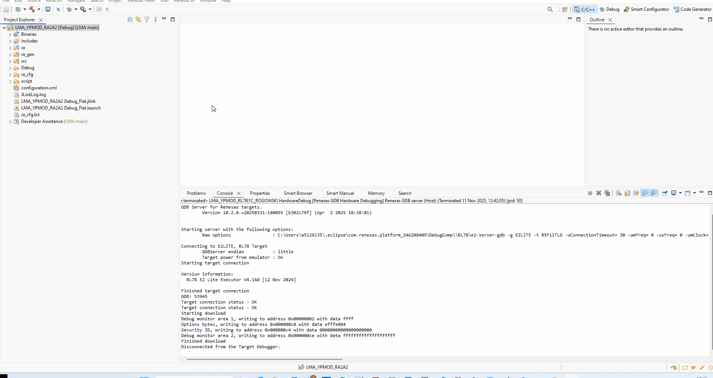
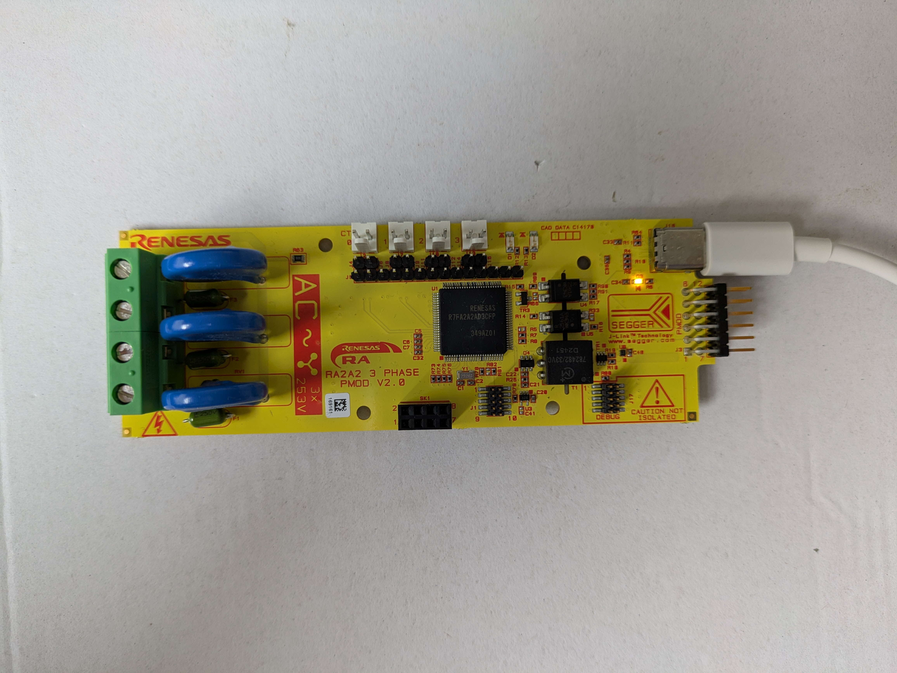
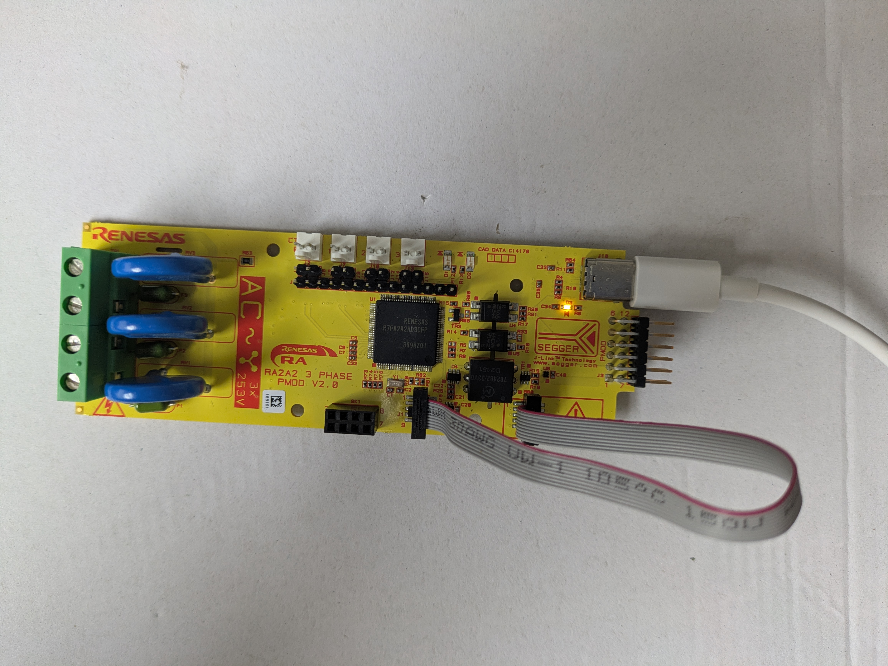
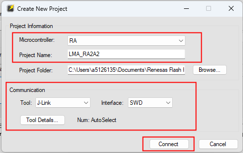
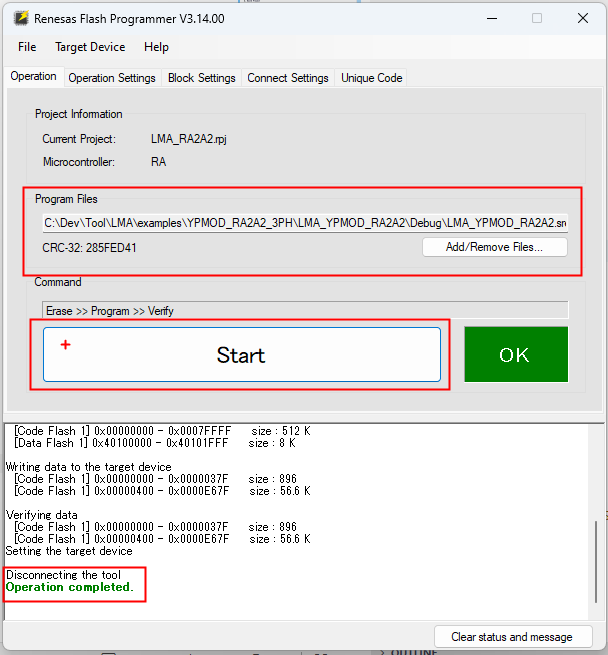
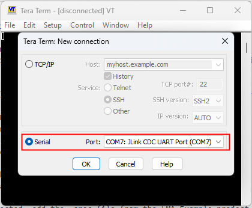
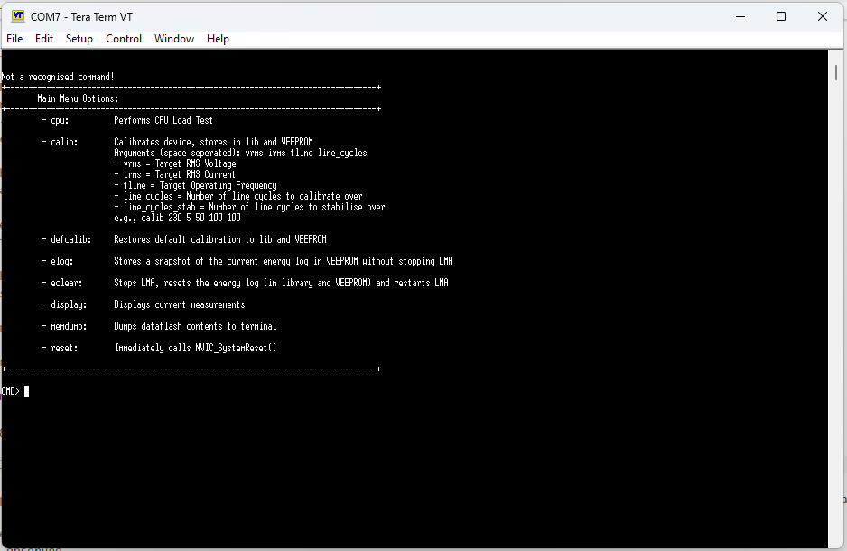

# 🛠️ RUNME.md — YPMOD-RA2A2-3PH

## 📦 Project Overview
This project contains firmware written in C for evaluating LMA in an example application - it makes use of a serial terminal to interact with the project and uses onboard impulse LED's for energy accumulation.

## 🧰 Requirements

### ✅ Hardware
- Evaluation PCB: `YPMOD-RA2A2-3PH` (For more information e.g., User Manual/Availability/Documentation please contact your local Renesas Sales/FAE)
- Microcontroller: `RA2A2 - R7FA2A2AD3CFP`
- Debugger/Programmer: `Segger J-Link OB`

### 💻 Software
- IDE: `e2 studio 2025-10+`
- FSP: `FSP 6.1.0+`
- Flashing utility: `Renesas Flash Programmer 3.14+`
- Serial terminal: `TeraTerm or PuTTY (9600 baud, 8-N-1)`

## 📁 Project Structure
```
├── LMA_YPMOD_RA2A2/        # e2 studio project
├── imgs/                   # images for this RUNME.md
└── RUNME.md                # This file
```

## 🚀 Getting Started

### 1. Clone the Repository
```bash
    git clone https://github.com/lwray-renesas/LMA.git
```

### 2. Import project to e2 studio
1. Open e2 studio.
2. `File → Import → General → Existing Projects into Workspace`
3. Select `<LMA_root>/examples/YPMOD_RA2A2_3PH/LMA_YPMOD_RA2A2`.
4. Do not copy into workspace.
5. Click Finish.


### 3. Build the project

1. Right click the project
2. Build Project



### 4. Serial Connection

Now to enable the evaluation, connect to the PMOD via USB-C on J16.



## 🧪 Testing

### 🕹️ Standalone Mode

First we must make the connection between the USB-C JLOB on the PC side and the RA2A2 - to do this we must ypass the isolation and short the connections between J1 and J17, this can be seen below - please be aware this connection is not isolated and therefore you should NOT have the PMOD connected to the mains for this.



Launch RFP and connect to PMOD using the following settings:
* Microcontroller: RA
* Tool: J-Link
* Interface: SWD

As shown below.



Once connected, add the .srec file from the LMA Example project in the Debug folder and click start:
`<LMA_root>/examples/YPMOD_RA2A2-3PH/LMA_YPMOD_RA2A2/Debug/LMA_YPMOD_RA2A2.srec`

As shown below.



Now disconnect the cable between J1 and J17 to ensure isolation.

Launch TeraTerm and connect to the JLink CDC UART virtual COM port with settings: 9600-8-N-1



If nothing is displayed, hit enter, and the help message should be shown.



This example applciation is no running and it allows (among other commands) displaying live measurement parameters and performing a calibration.

It also performs impulse LED control using D1 on the YPMOD-RA2A2-3PH to acumulate energy. This PMOD can now be connected to a live supply and behaviour observed.

