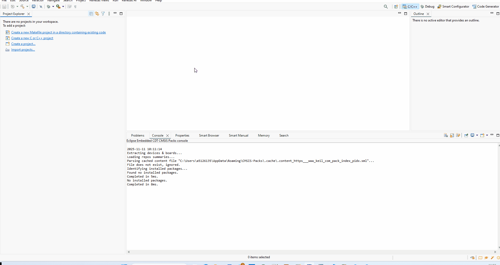
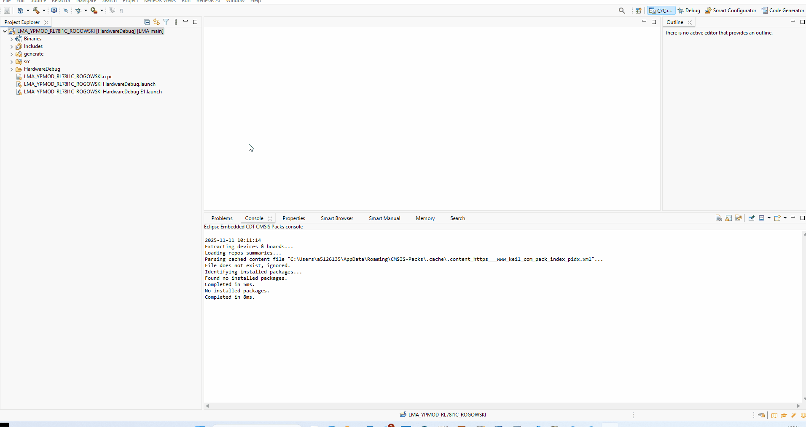
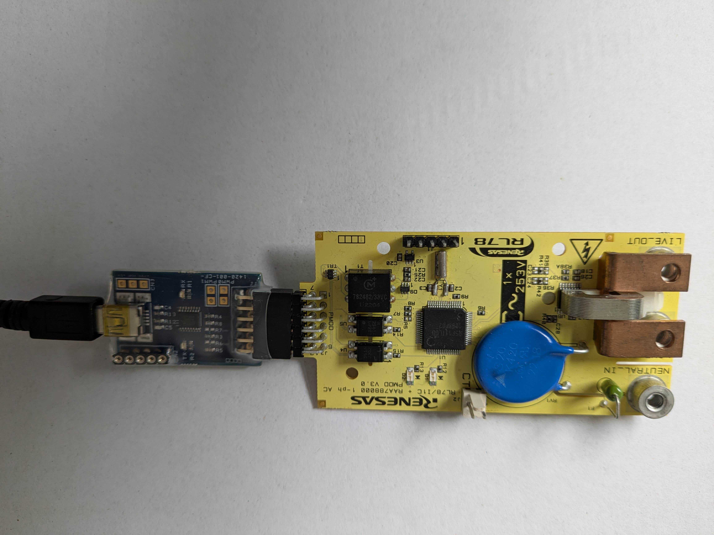
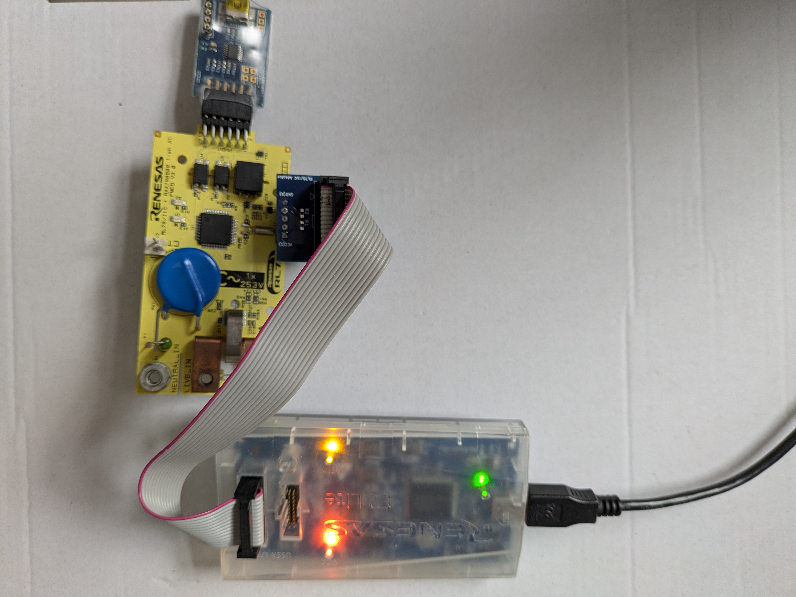
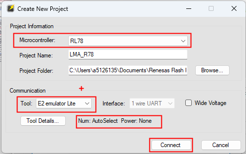
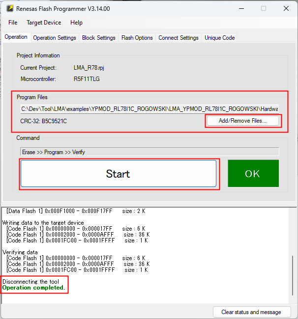
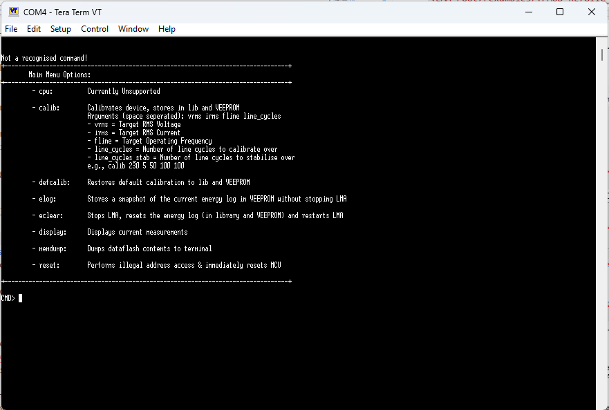
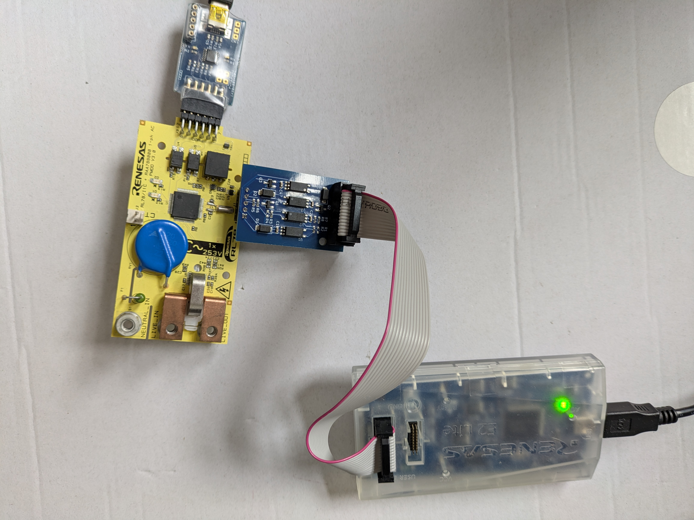
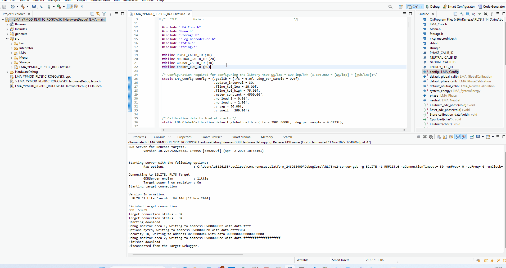

# 🛠️ RUNME.md — YPMOD-RL78I1C-ROGOWSKI

## 📦 Project Overview
This project contains firmware written in C for evaluating LMA in an example application - it makes use of a serial terminal to interact with the project and uses onboard impulse LED's for energy accumulation.

## 🧰 Requirements

### ✅ Hardware
- Evaluation PCB: `YPMOD-RL78I1C-ROGOWSKI` (For more information e.g., User Manual/Availability/Documentation please contact your local Renesas Sales/FAE)
- Communication Adaptor: `YPMOD-USB-G10` (For more information e.g., User Manual/Availability/Documentation please contact your local Renesas Sales/FAE)
- Microcontroller: `RL78/I1C - R5F11TLG`
- Debugger/Programmer: `E2 Lite`

### 💻 Software
- Toolchain: `Renesas CCRL V1.14.00+`
- IDE: `e2 studio 2025-10+`
- Flashing utility: `Renesas Flash Programmer 3.14+`
- Serial terminal: `TeraTerm or PuTTY (9600 baud, 8-N-1)`

## 📁 Project Structure
```
├── LMA_YPMOD_RL78I1C_ROGOWSKI/     # e2 studio project
├── imgs/                           # images for this RUNME.md
└── RUNME.md                        # This file
```

## 🚀 Getting Started

### 1. Clone the Repository
```bash
    git clone https://github.com/lwray-renesas/LMA.git
```

### 2. Import project to e2 studio
1. Open e2 studio.
2. `File → Import → General → Existing Projects into Workspace`
3. Select `<LMA_root>/examples/YPMOD_RL78I1C_ROGOWSKI/LMA_YPMOD_RL78I1C_ROGOWSKI`.
4. Do not copy into workspace.
5. Click Finish.



### 3. Build the project

1. Right click the project
2. Build Project



### 4. Serial Connection

Now to enable the evaluation, connect the YPMOD-USB-G10 to a PC via USB and then to the YPMOD-RL78I1C-ROGOWSKI on J3 (PMOD Connection), shown in the image below.



## 🧪 Testing

There are two ways to start testing this example project.

### 🕹️ Standalone Mode

First make the connection between the E2 Lite and the YPMOD-RL78I1C-ROGOWSKI as per the YPMOD-RL78I1C-ROGOWSKI user manual.
For convenience there is an open source non-isolated programming adaptor which makes these connections [here](https://github.com/lwray-renesas/RL78-I1C-PMOD-Programming-Adaptor---Non-Isolated).

An example using this adpator is shown below.



Launch RFP and connect to PMOD using the following settings:
* Microcontroller: RL78
* Tool: E2 emulator lite
* Power: None

As shown below.



Once connected, add the .mot file from the LMA Example project in the HardwareDebug folder and click start:
`<LMA_root>/examples/YPMOD_RL78I1C_ROGOWSKI/LMA_YPMOD_RL78I1C_ROGOWSKI/HardwareDebug/LMA_YPMOD_RL78I1C_ROGOWSKI.mot`

As shown below.



Now disconnect the debugger from J1.

Launch TeraTerm and connect to the YPMOD-USB-G10 virtual COM port with settings: 9600-8-N-1

If nothing is displayed, hit enter, and the help message should be shown.



This example application is now running and it allows (among other commands) displaying live measurement parameters and performing a calibration.

It also performs impulse LED control using D1 on the YPMOD-RL78I1C-ROGOWSKI to acumulate energy.

This PMOD can now be connected to a live supply and behaviour observed.

### 🔌 Isolated Debug Adaptor
One way to run this project and get the full benefit of application debugging is to use an isolated debugging adaptor, rated at 5kv, this allows a developer to safely interact with the project code in a realistic environment i.e., debugging the project whilst the PMOD is connected to live mains voltages with real loads.

An example of an open source adaptor is [here](https://github.com/lwray-renesas/RL78-I1C-PMOD-Programming-Adaptor---Isolated) and it is the one used in this step.

Please note that to use the adaptor R18 and R19 on the YPMOD-RL78I1C-ROGOWSKI must be updated to 1k8 as per the modifications instructions in the readme for the [isolated programming adaptor](https://github.com/lwray-renesas/RL78-I1C-PMOD-Programming-Adaptor---Isolated).



For safe operation of this example project please note that 5kv isolation between PC/User and the live electronics is absolutely necessary - for more information on this please consult the YPMOD-RL78I1C-ROGOWSKI user manual.
However the above adaptor aims to fulfill that requirement for the debug connection.

Now inside e2 studio, select the example project and click the debug icon to start a debug session.



Launch TeraTerm and connect to the YPMOD-USB-G10 virtual COM port with settings: 9600-8-N-1

If nothing is displayed, hit enter, and the help message should be shown.


This example application is now running and it allows (among other commands) displaying live measurement parameters and performing a calibration.

It also performs impulse LED control using D1 on the YPMOD-RL78I1C-ROGOWSKI to acumulate energy.

This PMOD can now be connected to a live supply and behaviour observed.

